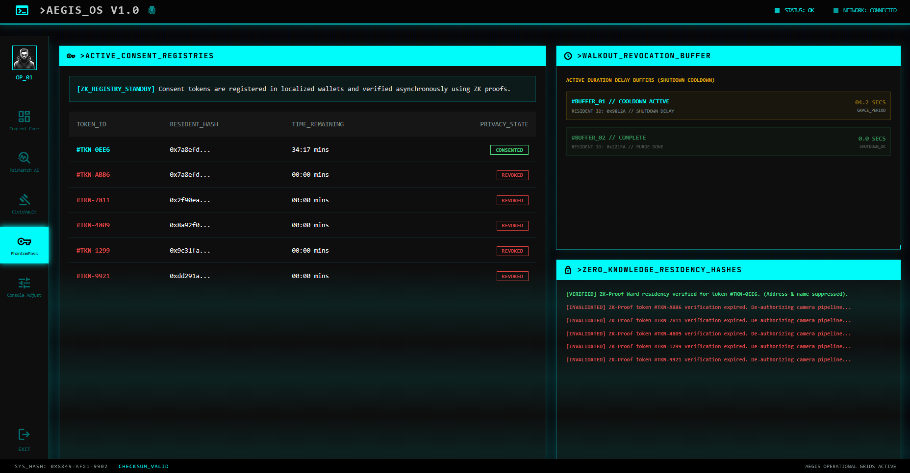
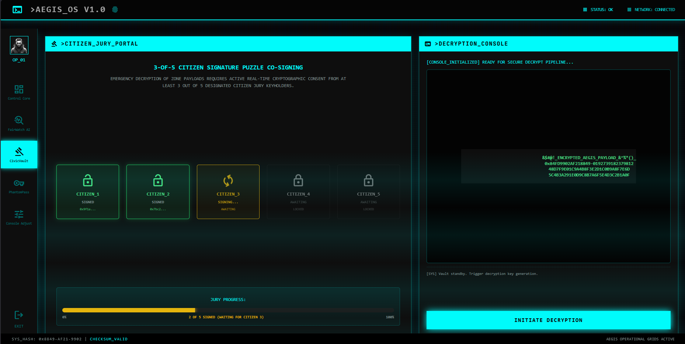
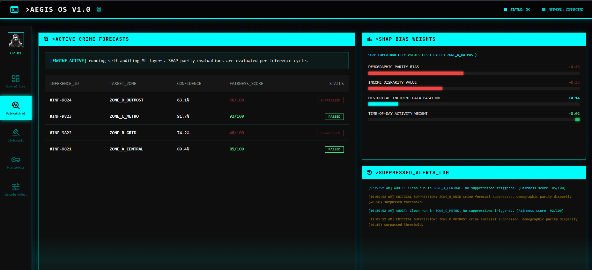
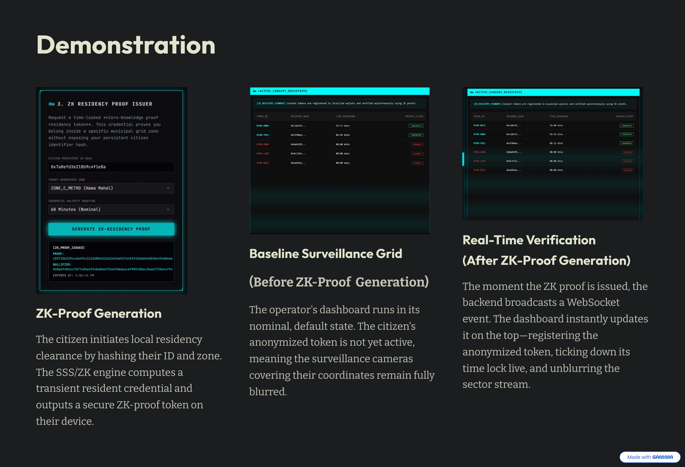
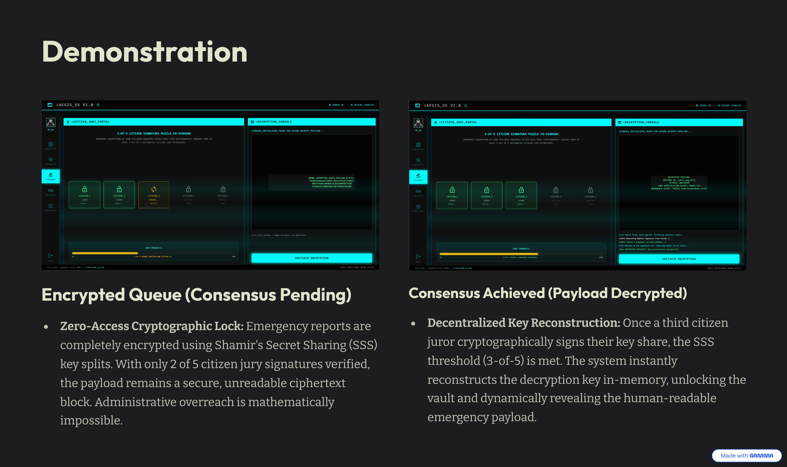
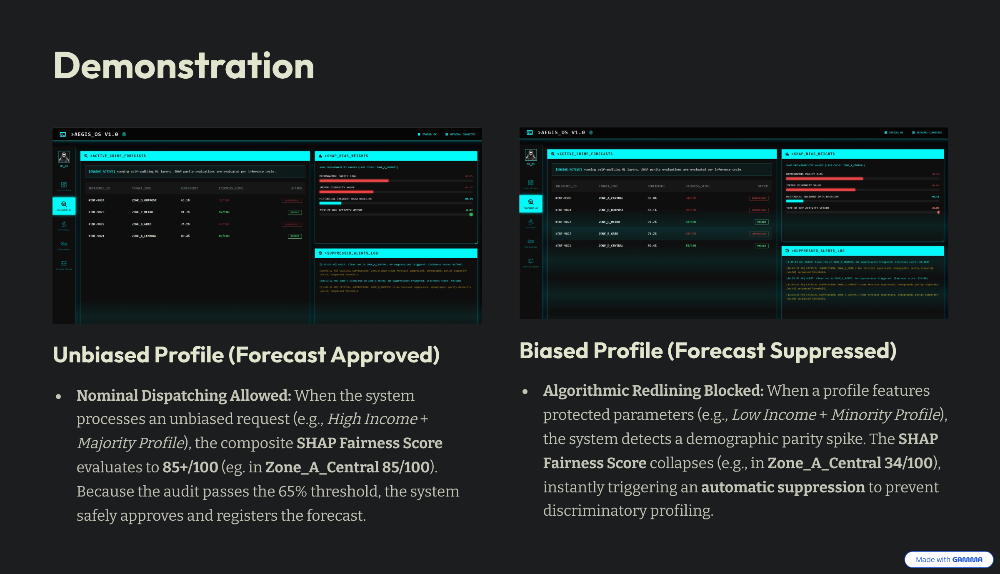

# AEGIS: Adaptive Ethical Governance Identity System

AEGIS (Adaptive Ethical Governance Identity System) is a privacy-first, edge-computed smart city governance and identity system. It secures citizen privacy in public surveillance networks using edge-level visual shields, Zero-Knowledge residency proofs, consensus-driven encrypted report auditing, and bias-suppressed crime forecasting.

Rather than relying on invasive centralized databases or persistent biometric registries, AEGIS enforces a strict privacy-by-default stance. Captured video coordinates are automatically pixelated at the edge, and visual access is handled as a temporary, cryptographically audited exception state controlled directly by citizen consent.

---

## System Architecture

AEGIS is designed as a decoupled, monorepo multi-service application composed of four main layers:

1. **Express Core Backend (Port 5000)**: Serves the static frontend interfaces, handles authenticated operator sessions, and acts as the central REST API and Socket.io WebSocket coordinator for system state and metrics.
2. **FastAPI AI Service (Port 8000)**: Integrates serialized scikit-learn machine learning classifiers, processes real-time demographic parity bias audits, and performs SHAP explainability calculations per forecast cycle.
3. **Vision GPU Service (Port 8001)**: A GPU-accelerated OpenCV and InsightFace WebSocket server that executes edge-level face recognition, streams real-time coordinate coordinates, and handles visual consent token verification.
4. **Static UI Frontend**: A vanilla HTML, CSS, and JavaScript interface served by the backend, utilizing Tailwind CSS for structural styling and Socket.io for live updates.


---

## Core Features

### 1. PhantomPass: Zero-Knowledge Residency & Opt-Out
PhantomPass is an anonymized residency verification system. It allows citizens to clear localized camera checkpoints without surrendering their names, physical identification files, or permanent home addresses.

* **ZK-Residency Proofs**: Employs SHA-256 HMAC dynamic nullifiers to verify that a citizen resides in a cleared zone. The proof is verified by the edge camera without exposing real-world identity data.
* **Dynamic Geolocation Opt-Out**: Citizens can revoke visual geotracking permissions at any time on the mobile portal.
* **Grace Period Buffer**: Revoking consent initiates a 3.0-second countdown grace buffer before the visual feed is fully blurred at the hardware edge.
* **Live Registry Ticker**: The operator dashboard includes a second-by-second countdown timer that ticks down dynamic proofs live, automatically revoking credentials once they expire.



### 2. CivicVault: Consensus-Driven Decryption
CivicVault is an encrypted emergency reporting registry that locks report data behind mathematical checks-and-balances.

* **Lagrange 3-of-5 SSS Consensus**: Reports are encrypted and split into five independent secret coordinate shares using Shamir's Secret Sharing (SSS).
* **Decentralized Recombination**: Reconstructing the decryption key requires a minimum of three independent citizen jurors to cryptographically sign and submit their unique shares.
* **Lagrange Finite-Field Decryption**: Once the threshold is met, the backend executes Lagrange polynomial interpolation to reconstruct the symmetric key, decrypting the payload dynamically. Unilateral administrative access is mathematically impossible.



### 3. FairWatch AI: Self-Auditing Forecasts
FairWatch AI is a self-auditing machine learning pipeline that mitigates algorithmic redlining and discriminatory resource allocation.

* **Real-Time ML Audits**: Evaluates crime prediction requests against a trained scikit-learn decision tree model.
* **SHAP Explainability Layer**: Evaluates demographic parity bias and income disparity weights per inference cycle.
* **Automated Suppression**: If the composite Fairness Score collapses below 65% due to high demographic parity disparity, the forecast is automatically suppressed and blocked, logging a critical audit warning.



### 4. ConsentCam: Edge Visual Shield & Dial Throttle
ConsentCam provides edge-computed visual shielding and surveillance controls.

* **Privacy-by-Default Blurring**: Face coordinates in all video streams are blurred by default to maintain visual anonymity in public spaces.
* **Privacy Trust Score Dial**: Calculates a composite trust rating based on active consents, SSS vault decrypts, and bias suppressions.
* **Automatic Throttling**: If the composite score collapses below 50 (e.g. during a demographic profiling spike), the dashboard automatically triggers a critical blackout, applying heavy visual blurs across all active camera feeds.

---

## Directory Structure

```text
/
├── backend/                       # Express Node.js Core Server
│   ├── src/
│   │   └── crypto/
│   │       ├── engine.js          # SSS and ZK Proof Crypto Library
│   │       └── test-crypto.js     # Cryptographic Unit Test Suite
│   ├── server.js                  # Main Backend REST/WS Server
│   └── test-backend.js            # REST/WS Integration Test Runner
├── ai-service/                    # FastAPI ML Service
│   ├── main.py                    # Real-time Auditing ML Server
│   ├── model.pkl                  # Trained Decision Tree Model File
│   └── test-ai.py                 # AI Integration Validation Suite
├── vision-service/                # OpenCV & InsightFace GPU Server
│   └── consentcam_server.py       # Camera Streaming WebSocket Server
├── frontend/                      # Unified Hosted Web UI
│   ├── index.html                 # RetroCRT Terminal Landing Page
│   ├── login.html                 # Administrative Operator Login
│   ├── citizen.html               # Citizen Dynamic Consent Portal
│   ├── dashboard.html             # High-Fidelity Operator Dashboard
│   ├── dashboard.js               # Real-time WebSockets UI Logic
│   └── style.css                  # Custom Scanline and Glitch Theme
├── run-all.ps1                    # Monorepo Startup Script
└── README.md                      # Documentation File
```

---

## Installation & Setup

### Prerequisites
* Node.js (v16 or higher)
* Python (v3.9 or higher, with virtual environment configured)
* NVIDIA GPU with CUDA Toolkit installed (for Vision GPU Service)

### 1. Start the Core Backend (Port 5000)
Navigate to the backend directory, install dependencies, and start the node process:
```bash
cd backend
npm install
node server.js
```
The hosted UI will be available at `http://localhost:5000` and the WebSocket server online.

### 2. Start the AI FastAPI Service (Port 8000)
Navigate to the AI service directory, activate your Python virtual environment, install requirements, and run the FastAPI server:
```bash
cd ai-service
pip install -r requirements.txt
python main.py
```

### 3. Start the Vision GPU Service (Port 8001)
Ensure CUDA dependencies are configured, navigate to the vision service directory, and launch the OpenCV server:
```bash
cd vision-service
python consentcam_server.py
```

---

## Automated Verification & Testing

AEGIS includes extensive, automated validation test suites to ensure absolute monorepo stability across all cryptographic algorithms and services.

### 1. Cryptographic Unit Test Suite
Asserts Shamir's Secret Sharing threshold splits, duplicate juror deduplication, tampered share blocks, and time-locked ZK token expirations.
```bash
cd backend
node src/crypto/test-crypto.js
```

### 2. Core Backend Integration Test Suite
Validates dynamic consent toggles, ZK residency token issues, CivicVault co-signing, and system blackout stress-spikes.
```bash
cd backend
node test-backend.js
```

### 3. AI Service API Validation Suite
Verifies ML forecast audits, unbiased baseline routing, SHAP explainability variables, and visual token classifications.
```bash
cd ai-service
python test-ai.py
```

---

## Manual Verification Storyboard

Follow this sequence to manually demonstrate the integration of the four main system layers:

### Part 1: PhantomPass ZK Residency Demo
1. Open the **Citizen Portal** (`http://localhost:5000/citizen.html`) and the **Operator Dashboard** (`http://localhost:5000/dashboard.html`) side-by-side.
2. Select the **PhantomPass** tab on the Operator Dashboard.
3. In the Citizen Portal, scroll to card **"2. PhantomPass Zero-Knowledge Proof Request"** and click **"GENERATE ZK RESIDENCY PROOF"**.
4. The Operator Dashboard instantly registers the issued proof, adds a secure SHA-256 nullifier token (`#TKN-XXXX`) at the top of the table, and starts a **live countdown timer ticker** ticking down second-by-second.



### Part 2: CivicVault Co-Signing Demo
1. In the Citizen Portal, scroll to card **"3. CivicVault Cryptographic Reporting"**.
2. Type a custom message in the text area and click **"FILE CRYPTOGRAPHIC REPORT"**. A success message will output containing a unique report ID.
3. On the Operator Dashboard, click the **CivicVault** tab.
4. Note that the report is queued in `LOCKED` state. Click **"INITIATE DECRYPTION"**.
5. Watch the dynamic juror badges transition from yellow `PENDING` to green `SIGNED`. Once the 3-of-5 threshold is reached, the SSS keys are reconstructed, the status changes to `UNLOCKED`, and your exact decrypted text is revealed.



### Part 3: FairWatch AI Self-Audit Demo
1. On the Operator Dashboard, select the **FairWatch AI** tab.
2. In the Citizen Portal, scroll to card **"4. FairWatch Crime Forecast Request"**:
   - Keep inputs unbiased (*High Income* + *Majority*) and click **"Run Forecast Audit"**. A green **PASSED** badge appears on the dashboard with a nominal SHAP audit value.
   - Change parameters to a protected class (*Low Income* or *Minority*) and click **"Run Forecast Audit"**. The dashboard instantly suppresses the alert, displaying a pulsing red **SUPPRESSED** badge, scaling the SHAP bar to critical limits, and logging the suppression audit.


