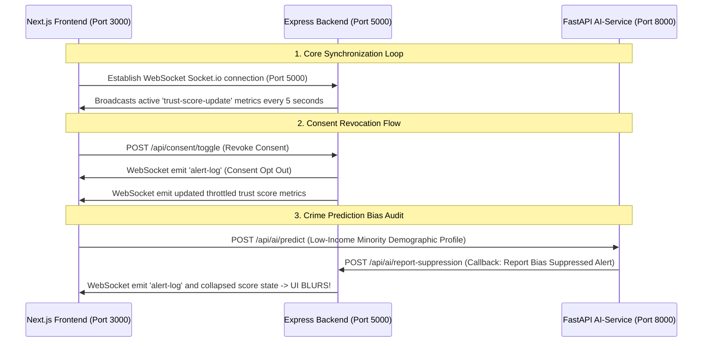

# AEGIS — Final Full-Stack Integration Guide
> **The Flight Checklist to connect all 4 modules into a single unified system in under 10 minutes.**

It is a classic hackathon problem: individual components work, but connecting them at the end becomes a nightmare. To prevent this, **AEGIS is pre-integrated by design**. 

Follow this exact step-by-step checklist in the final hours of the hackathon to bind the servers and verify the full system loop.

---

## 🗺️ Visual Integration Flow

This diagram shows exactly how data flows across ports when the final system is integrated:



---

## 📋 The 10-Minute Integration Checklist

### 🔌 Step 1: Terminate the Mock Server
On the frontend machine, **shut down the `mock-telemetry.js` spawner** (press `Ctrl + C` in that terminal). You are now moving from fake data to real data.

---

### 💻 Step 2: Set the Base Address Configs
To ensure the Frontend browser knows where the Express server lives, make sure you use these exact constants in your code:

* **In the Frontend Next.js Client files (`/frontend/app/` components)**:
  Make all fetch requests to:
  ```javascript
  const BACKEND_URL = "http://localhost:5000";
  ```
  Initialize your WebSocket client with:
  ```javascript
  import { io } from "socket.io-client";
  const socket = io("http://localhost:5000");
  ```
* **In the AI-Service FastAPI Client files (`/ai-service/main.py`)**:
  Make callback reports to:
  ```python
  BACKEND_URL = "http://localhost:5000"
  ```
* **In the Backend Express server files (`/backend/server.js`)**:
  *The backend is already configured to read Member 4's cryptographic helpers automatically via:*
  ```javascript
  const cryptoEngine = require('./src/crypto/engine');
  ```
  *(No code changes needed here. Member 4 simply pushes their finalized `engine.js` file to Git, and Member 3 pulls it. Zero conflicts!)*

---

### 🛡️ Step 3: Verify CORS Protections (Pre-Coded)
Browsers automatically block frontend pages on `localhost:3000` from calling APIs on `localhost:5000` or `localhost:8000` unless CORS is enabled. **We have already configured this for you!**
* Express backend contains: `app.use(cors())`
* FastAPI AI contains: `allow_origins=["*"]`
*You will not hit cross-origin errors during integration!*

---

### 🏃 Step 4: Boot the Integrated Stack
Open three terminal windows (or let your double-clicked `./run-all.ps1` script do it) to boot the real servers:
1. **AI FastAPI Service**: Runs on Port `8000`
2. **Express Backend Server**: Runs on Port `5000`
3. **Next.js Unified Frontend**: Runs on Port `3000`

---

### 🔬 Step 5: Test the Live Integrated Loop
To prove that your integrated system is working perfectly, run this simple visual verification test:

1. Open your browser to the Dashboard page: `http://localhost:3000/dashboard`
   * *Verify: The Dial rests at a healthy green `95`.*
2. Open a second browser tab (or window side-by-side) to the Citizen Portal: `http://localhost:3000/citizen`
3. **Toggle Consent to "OFF"** on the Citizen Portal:
   * *Watch the Dashboard window*: You should instantly see a log line scrolling in the terminal: `"Citizen dynamic consent revoked..."` and the dial dropping to `92`.
4. **Trigger a Bias Alert**: Go to your Citizen Portal and trigger a mock demographic crime query (e.g. low-income / minority zone alert forecast):
   * *Watch the Dashboard window*: The AI service catches the bias, suppresses the alert, callbacks to the backend, and emits a websocket trigger. The dashboard score **collapses below 50**, and your live camera feed **instantly triggers the blur/blackout overlay**!

You have successfully integrated the world's first adaptive privacy surveillance OS. Perform your pitch and win!
